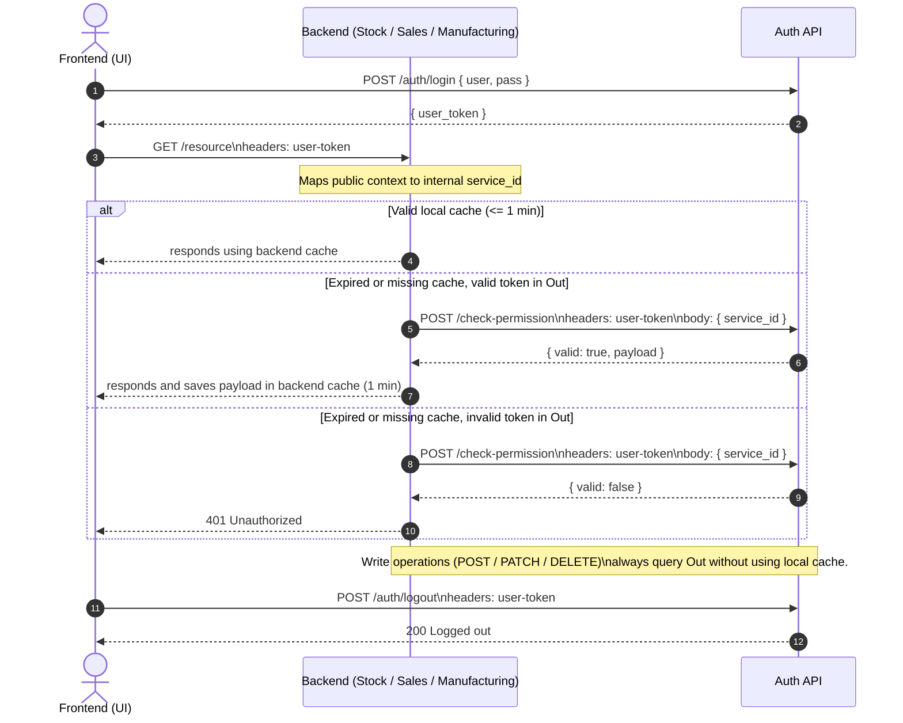

# EQEQO API AUTH

Centralized authentication and authorization service for the **Eqeqo** ecosystem.
Issues short-lived tokens, renews them atomically near expiry, and enforces access control with a DB-backed token cache plus periodic cleanup.


## ⚙️ Setup

**Local setup**
```bash
psql -U postgres -f db/run_all.sql
cp .env.example .env
cargo run
```

**Tests**
Integration tests rely on the seeded `api_auth` DB from `db/run_all.sql`.
Default server: `http://127.0.0.1:7878`

```bash
cargo test --test api_test
```

**Environment:**

Copy and modify.

```
cp ./.env-example ./.env
```

Data reference: see `./db/DB.md` (seeded dataset: IDs, users, services, roles, permissions).

## 🔐 Auth essentials
- All protected routes require the `user-token:` header (never pass tokens in URLs).
- Tokens are cached centrally in `auth.tokens_cache`; renewals write once per request and only when near expiry.
- Login returns the existing token when still valid; otherwise issues a new one.
- Logout or user deletion revokes related tokens; a background job prunes expired tokens every ~60 seconds.
- Minimal logging per request records token, endpoint, timestamp, and IP.
- Tokens are stored in plaintext in the cache; user passwords are stored as bcrypt hashes (demo users seeded with bcrypt).
- `/check-permission` uses headers for tokens: `user-token` always, plus `service-token` for backend calls; body only carries `service_id` when needed.

## 🔎 Auth flows (simple)
**Frontend or unsafe clients**
- Client sends only the `user-token` header.
- Backend maps public context to internal `service_id`.
- Backend calls `POST /check-permission` with `user-token` header and body `{ service_id }`.
- Auth treats requests with `service_id` as frontend/unsafe context.
- Do not expose a service token or `service_id` to end users.

**Backend to backend**
- Use `user-token` + `service-token` headers.
- Call `POST /check-permission` with those headers (body can be `{}`).
- Auth treats requests with `service_token` as backend-to-backend.
- Service token stays only on the server.

## 🚀 Quick request example
Example: fetching user data for “Juan” (id `7`) from client `servcli1` using a user token:

```bash
curl -X GET "http://127.0.0.1:7878/users/7" \
  -H "user-token: user_tok_example_123" \
  -H "x-client-id: servcli1"
```

`x-client-id` is optional metadata; the API currently only enforces the `user-token` header.

Example: checking permission (frontend/unsafe):
```bash
curl -X POST "http://127.0.0.1:7878/check-permission" \
  -H "user-token: user_tok_example_123" \
  -H "content-type: application/json" \
  -d '{"service_id":2}'
```

Example: checking permission (backend/safe):
```bash
curl -X POST "http://127.0.0.1:7878/check-permission" \
  -H "user-token: user_tok_example_123" \
  -H "service-token: svc_tok_example_456" \
  -H "content-type: application/json" \
  -d '{}'
```


## 🧩 Endpoints

| Method | Path | Description (minimal example) |
| ------ | ---- | ----------------------------- |
| **POST** | `/auth/login` | Issue token for user (global). Example: `{"username":"adm1","password":"adm1-hash"}` |
| **POST** | `/auth/logout` | Revoke current token. Header: `user-token: <value>` |
| **GET** | `/auth/profile` | Validate and optionally renew token. Header: `user-token: <value>` |
| **POST** | `/check-permission` | Validate access. Headers: `user-token` and optional `service-token`. Body: `{ "service_id": 2 }` when service token is not used. |
| **GET** | `/users` | List users. Header: `user-token: <value>` |
| **POST** | `/users` | Create user. Example body: `{"username":"user1","password_hash":"pass","name":"User","person_type":"N","document_type":"DNI","document_number":"123"}` + header `user-token`. |
| **PUT** | `/users/{id}` | Update user. Example: `{"name":"New Name"}` + header `user-token`. |
| **DELETE** | `/users/{id}` | Delete user and revoke tokens. Header: `user-token`. |
| **GET** | `/roles` | List roles. Header: `user-token`. |
| **POST** | `/roles` | Create role. Example: `{"name":"Editor"}` + header `user-token`. |
| **GET** | `/roles/{id}` | Get role. Header: `user-token`. |
| **PUT** | `/roles/{id}` | Update role. Example: `{"name":"New Role"}` + header `user-token`. |
| **DELETE** | `/roles/{id}` | Delete role. Header: `user-token`. |
| **GET** | `/permissions` | List permissions. Header: `user-token`. |
| **POST** | `/permissions` | Create permission. Example: `{"name":"export"}` + header `user-token`. |
| **PUT** | `/permissions/{id}` | Update permission. Example: `{"name":"export_csv"}` + header `user-token`. |
| **DELETE** | `/permissions/{id}` | Delete permission. Header: `user-token`. |
| **POST** | `/role-permissions` | Assign permission to role. Example: `{"role_id":1,"permission_id":2}` + header `user-token`. |
| **DELETE** | `/role-permissions` | Remove permission from role. Example: `{"role_id":1,"permission_id":2}` + header `user-token`. |
| **GET** | `/roles/{id}/permissions` | List role permissions. Header: `user-token`. |
| **POST** | `/services` | Create service. Example: `{"name":"Stock","description":"Inventory"}` + header `user-token`. |
| **GET** | `/services` | List services. Header: `user-token`. |
| **PUT** | `/services/{id}` | Update service. Example: `{"description":"New desc"}` + header `user-token`. |
| **DELETE** | `/services/{id}` | Delete service. Header: `user-token`. |
| **POST** | `/service-roles` | Assign role to service. Example: `{"service_id":1,"role_id":2}` + header `user-token`. |
| **DELETE** | `/service-roles` | Remove role from service. Example: `{"service_id":1,"role_id":2}` + header `user-token`. |
| **GET** | `/services/{id}/roles` | List roles of a service. Header: `user-token`. |
| **POST** | `/person-service-roles` | Assign role to person in service. Example: `{"person_id":1,"service_id":1,"role_id":2}` + header `user-token`. |
| **DELETE** | `/person-service-roles` | Remove role from person in service. Example: `{"person_id":1,"service_id":1,"role_id":2}` + header `user-token`. |
| **GET** | `/people/{person_id}/services/{service_id}/roles` | List roles of person in service. Header: `user-token`. |
| **GET** | `/services/{service_id}/roles/{role_id}/people` | List people with role in service. Header: `user-token`. |
| **GET** | `/people/{person_id}/services` | List services of a person. Header: `user-token`. |
| **GET** | `/people/{person_id}/services/{service_id}` | Get user data plus roles/permissions for that service. Header: `user-token`. |
| **POST** | `/person-service-permissions` | Grant a permission directly to a person in a service (creates/uses a scoped role). Example: `{"person_id":1,"service_id":1,"permission_name":"read"}` + header `user-token`. |


## 🔁 Token logic
- Generated at login (`hash(secret + random + timestamp)`). NO JWT nor similar.
- Stored centrally in `auth.tokens_cache` with `payload` and `expires_at`; token values are stored in plaintext.
- Per-service permission snapshots are stored in `auth.permissions_cache` keyed by `(token, service_id)` with `permissions` and `expires_at`.
- Tokens are issued per **user** (global); services query permissions via `POST /check-permission`.
- Each user has a single active token; login reuses it until it expires.
- All protected requests must include `user-token:` header (no query params). `/auth/login` is the only public route.
- Short TTL (2–5 min) with atomic renewal near expiry to avoid contention.
- `/check-permission` reads from cache and only rewrites on renew threshold (no multiple writes per request).
- Revocation on logout or user deletion; cleanup job periodically removes expired tokens.
- Access checks are always `POST /check-permission` with `user-token` header and either body `{ service_id }` or `service-token` header.
- No tokens in URLs.
- Minimal logging per request: token, endpoint, timestamp, IP.
- Background cleanup job trims expired tokens every ~60 seconds.


## 🧭 Use case diagram



SUIGUIENTE IMPLEMENTACION, OMITIR POR AHORA
## 🧰 Rust client (server-side)
Location: `crates/eqeqo-api-auth-client`

- Covers all endpoints in this API.
- Includes an in-memory permission cache (default TTL 60s).
- You can plug a DB-backed cache by implementing `PermissionCache`.

Example:
```rust
use eqeqo_api_auth_client::{ApiAuthClient, ServiceContext};
use serde_json::json;

let client = ApiAuthClient::new("http://127.0.0.1:7878");
let login = client.auth_login("adm1", "adm1-hash").await?;
let user_token = login["user_token"].as_str().unwrap();

let access = client
  .check_permission(user_token, ServiceContext::service_id(2))
  .await?;

let created = client
  .create_service(user_token, json!({ "name": "Stock", "description": "Inventory" }))
  .await?;
```


MIT © Eqeqo
